# README #

## General ##

### What's here ? ###

This is our development project. Supervised by Maxime Lhoumeau in Paris I Panth�on Sorbonne University.

### Technical stack ###

#### Frameworks ####

Our frontend was made using the Angular Framework (HTML/SCSS/TS), and our backend with Spring Framework (Java).

#### Tools and libraries ####

We used :

* [Angular Material](https://material.angular.io/) component library.  
* [Leaflet.js](https://leafletjs.com/), with GeoJSON structures to display data as layers on a map in our frontend.  
* [ngx-charts](https://github.com/swimlane/ngx-charts) Library, for graphical data visualization.  
* A [MongoDB](https://www.mongodb.com/fr) database for persistence.  
* [Project Lombok](https://projectlombok.org/), to help us reduce boilerplate code (setters, getters, constructors...).

## Conception ##

Our WEB application gathers data from multiple APIs, maps it to a defined format and stores it as NoSQL documents.

### Data sources ###

* Statistics from the [French Government's open datasets](data.gouv.fr), available in CSV format with stable links :
    * [Daily synthesis on COVID-19 indicators](https://www.data.gouv.fr/fr/datasets/synthese-des-indicateurs-de-suivi-de-lepidemie-covid-19/)
    * [Daily vaccine indicators](https://www.data.gouv.fr/fr/datasets/donnees-relatives-aux-personnes-vaccinees-contre-la-covid-19-1/)
* News related to COVID-19 from two APIs :
    * [Mediastack API](https://mediastack.com/)
    * [Smartable API](https://rapidapi.com/SmartableAI/api/coronavirus-smartable)
* [Static JSON](https://www.data.gouv.fr/fr/datasets/lieux-de-vaccination-contre-la-covid-19/) containing a list
  of vaccination centers.
* [French departments](https://github.com/gregoiredavid/france-geojson) in GeoJSON format.

#### Mapping ###

We had to map the retrieved data with mapper classes (inside `mappers` package) to our defined format in order to return 
and store them properly.  

* Mapping **indicators** from **CSV** to **Java** objects and returning them as JSON from the API  
  Before :  
    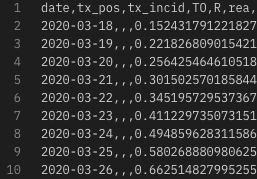 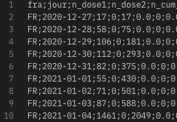  
  After:  
    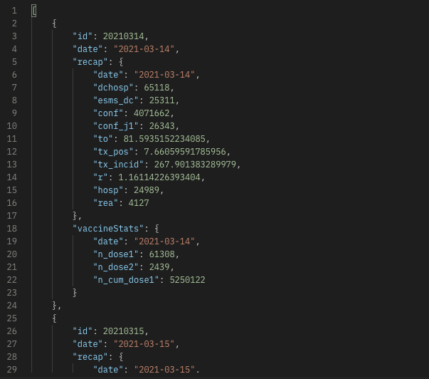  
* Mapping **news** from different sources (with different structures) to `NewsDTO`, lighter and easier to read and manipulate.  
  Before :  
    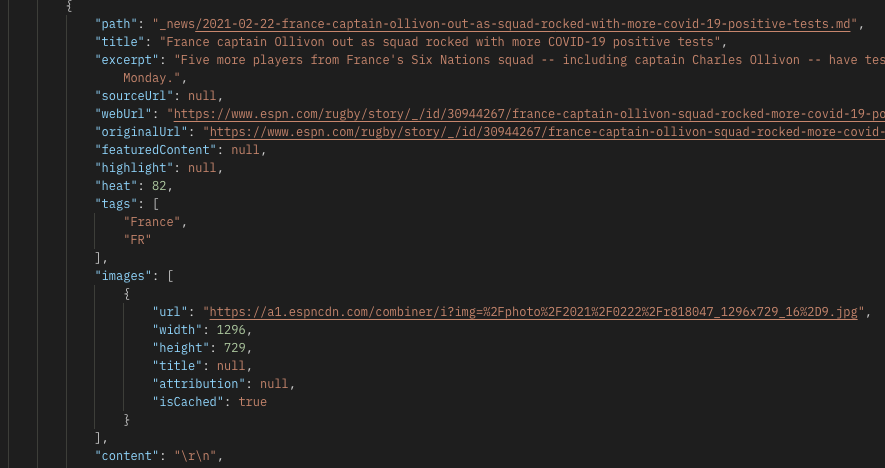  
  After:  
    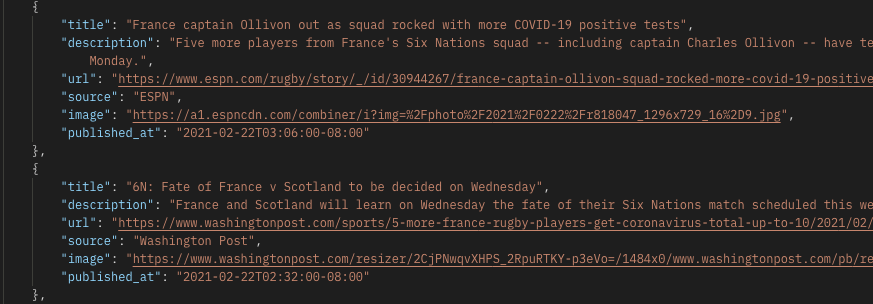  

#### Database structure ###

We keep four collections in our Mongo database :  

* `metrics` COVID-19 related data as mapped from the CSV files, one new document per day,
   older documents are updated (see 'Scheduled actions' section).  
* `news` COVID-19 related news, the APIs' free plans being limited to 500 calls per month, we had to persist them
   in order to limit our calls number to once a day (31 max. calls/month).  
* `mails` to store subscribed users' e-mail addresses.  
* `centres` to store vaccination centers addresses and ZIP codes.  

#### Scheduled actions ###

Some actions needed scheduling, to do so, we used Spring `@Scheduled` annotation with CRONs.
* **Mail reports** : users who subscribed to the app receive daily reports at 9PM.
* **Data completion** : some data retrieved from the government's APIs do not appear until some days after the concerned 
  date (as for positivity rates, because we have to wait for test results to calculate it), so we scheduled a method
  which runs on a daily basis (at 2AM), retrieves older indicators and updates stored data with new numbers if found.
* **News** : calls news APIs once a day to retrieve new articles and stores them in DB.

## Preview ##

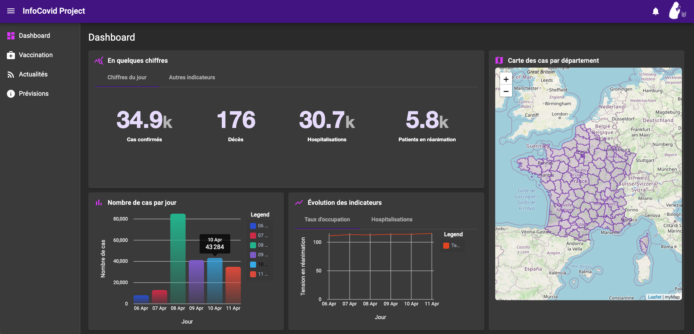  
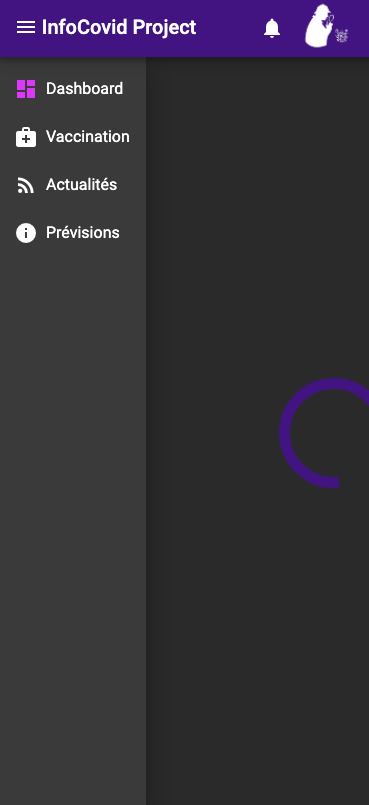
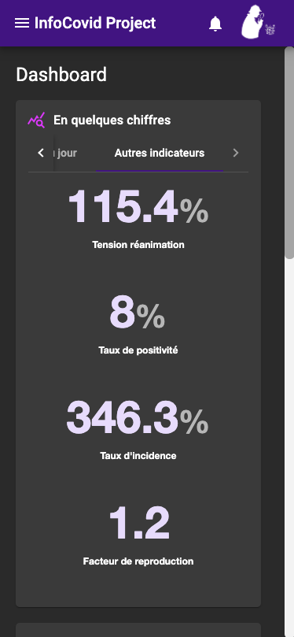
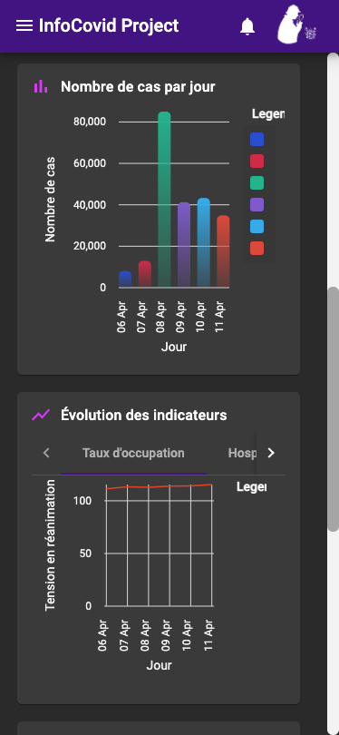
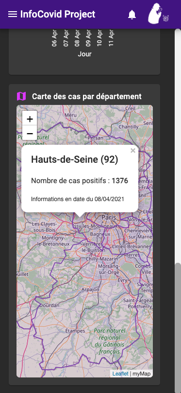
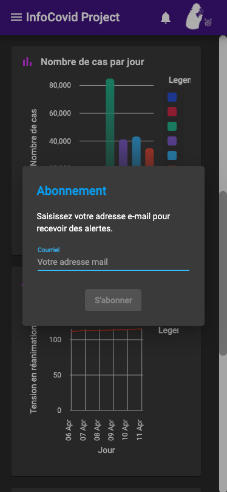

## How to install ##

1. Clone this repository.  
2. `cd` into `infocovid`, `mvn install` and run the Spring Boot project.  
3. `cd` into `infocovid/webapp`, `npm install` and run the Angular application with `ng serve`.  

NB : The database link in our Spring Mongo configuration class points to a cloud-stored database on MongoDB Atlas,
if you want to view the database live on your machine, follow these steps before step 2. :  

* Uncomment the local database link in the configuration class (`com.pantheonsorbonne.infocovid.config.MongoConfig`)  
* Run `mongod` on your machine, by using MongoDB Compass, create a database named `scoovidoo`, add four collections :
  `news`, `metrics`, `mails` and `centres`.  
* Import `./files/centres-vaccination.json` inside the `centres` collection.  

## Deployment ##
Application is deployed and accessible on [infcovid.herokuapp.com](infocovid.herokuapp.com)

## Authors ##
* Massil TAGUEMOUT
* Nelly UNG
* William DAI
* Sarah MEZIANE